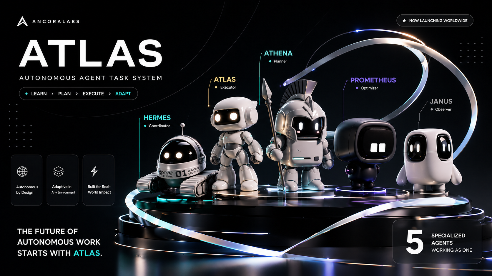

# Ancora Labs

  

  I build autonomous software systems that learn, plan, execute, and adapt in real production environments.

  <a href="https://github.com/Ancora-Labs">Explore Repositories</a>

## About

Ancora Labs is my vehicle for building practical autonomous systems, orchestration tooling, and modern product infrastructure.
I care about clear operating models, strong UX direction, and software that can survive contact with real usage.

The flagship direction is represented by ATLAS: an autonomous agent task system built around specialized roles working as one coordinated runtime.

## ATLAS

ATLAS is designed as a multi-agent system where each role has a clear responsibility inside the delivery loop:

- Athena for planning
- Prometheus for optimization
- Hermes for coordination
- Janus for observation
- Atlas for execution

This is the kind of software I want to build more of: systems that are ambitious in capability, but disciplined in structure.

## What I Build

- autonomous agent products
- orchestration and control systems
- internal tooling for execution-heavy teams
- software delivery loops with strong observability and operator control

## How I Work

- I prefer clear responsibilities over vague intelligence.
- I optimize for systems that can be operated, inspected, and improved.
- I care about product feel as much as technical depth.
- I build for real environments, not just ideal demos.

## Current Direction

Right now, my focus is on software that makes autonomous work more reliable, more legible, and more useful.
That means better agent coordination, better operator visibility, and stronger systems around planning, execution, and recovery.